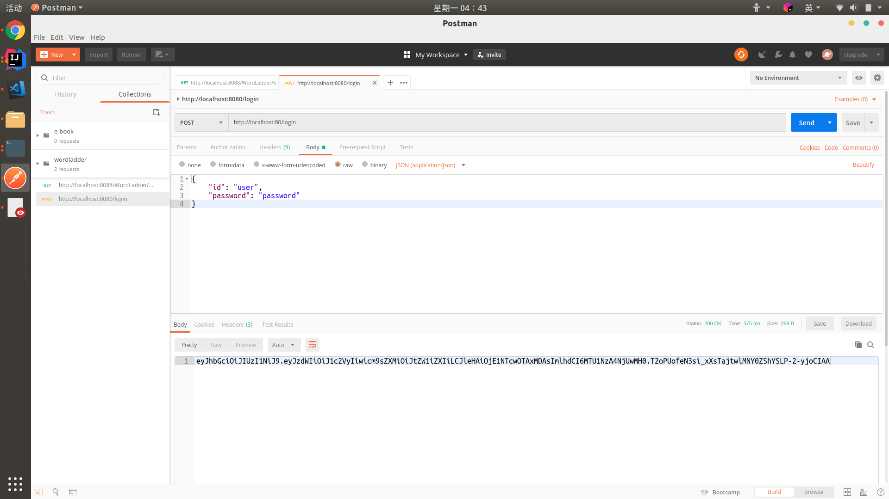
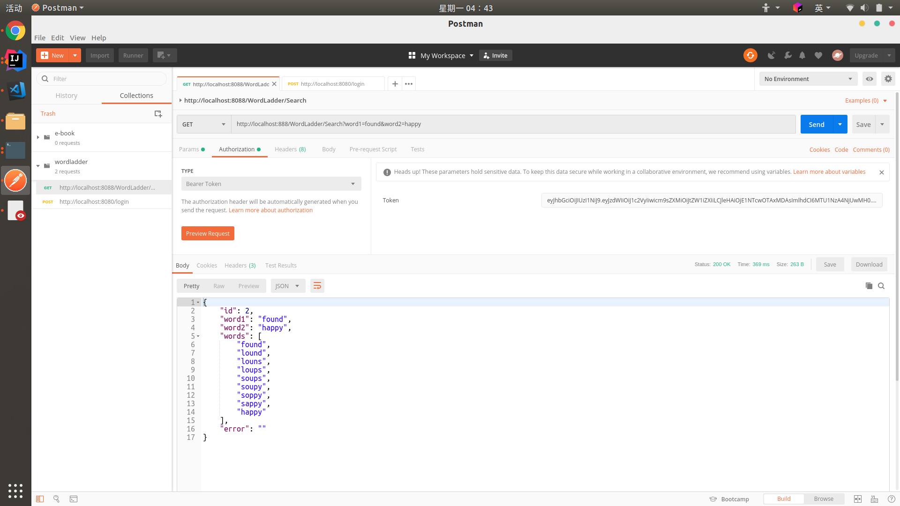
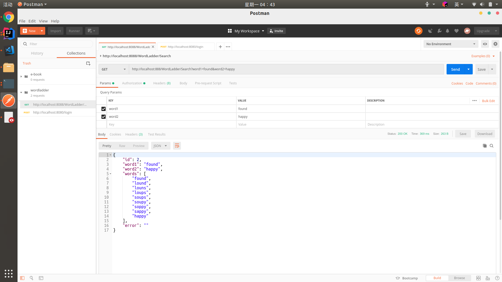

# Readme

## HW-3

- Split your REST Service of Homework II into two microserices
  - Login
  - Function
    - WordLadder
  - Ignore the authentication workflow

- Dockerized the two microservices
  - Dockerhub: https://hub.docker.com/r/zydiii/wordladder
  - Docker file & readme

## How to use this image

### Pull the image

```
$ docker pull zydiii/wordladder:login
$ docker pull ztdiii/wordladder:ladder
```
When pulling is done, you can enter

```
$ docker images
```
to check whether both have been successfully added to your the docker images.

### Run the image

```
$ docker run -it -p 80:8080 -d zydiii/wordladder:login
$ docker run -it -p 88:8088 -d zydiii/wordladder:ladder
```

First, you can visit localhost:80/login with JSON

```
{
    "id": "user",
    "password": "password"
}
```
to get the **JWT token**. This token can be valid for just one hour.



Then, visit localhost:88/WordLadder/Search with **Bearer Token**: the JWT token returned after you successfully login.



And you can enter **word1** and **word2** to use the wordladder.



### Stop and Remove the image

```
$ docker stop $CONTAINER ID$
$ docker rmi zydiii/wordladder:$tag$
```