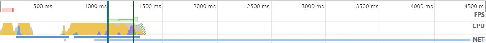
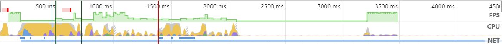

# Task 1

## How to use 'F12'

[Chrome 开发者工具](<https://developers.google.com/web/tools/chrome-devtools/?hl=zh-cn>) gives a detailed description  of  DevTools.  Let's follow it and analyze the home page loading of [SJTU](<https://www.sjtu.edu.cn/>).

### Compare with other website home page

Let's make a comparison between these three websites:

[上海交通大学中文主页门户网站](https://www.sjtu.edu.cn/)

[中国大学MOOC](https://www.icourse163.org/)

[淘宝](https://www.taobao.com/)

- Summary

Let's keep the reload page information of each website. Here is the summary part(they're from SJTU, MOOC and TaoBao):

The first image is from SJTU. We can see that it spent the longest time to load. Basically each event is much longer than the others.

*Scripting* and *Rendering* are typically longer than the others. Thus, let's pay more attention to events.

- Overview

Let's have a look at overview. The images bellow show FPS, CPU and NET(they're from SJTU, MOOC and TaoBao):

**FPS**

We can see that the home page of SJTU exists long time red block, which means it's highly possibe to get stuck.

**CPU**

SJTU takes large CPU. Script and Style Sheet take a large part of CPU.

**NET**

SJTU has long blue line. It means that it will spend a long time to search. But the waiting time is short.

### Carry out optimization solution

