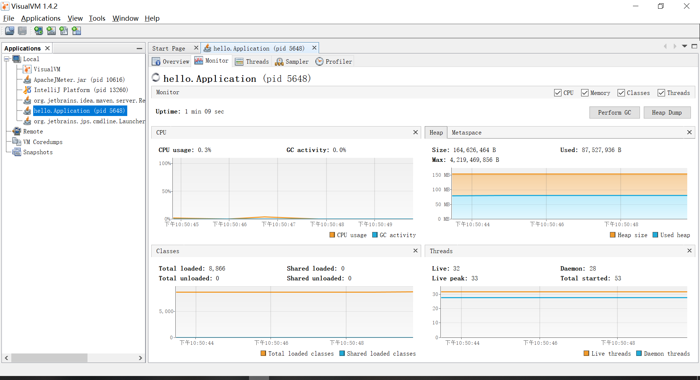
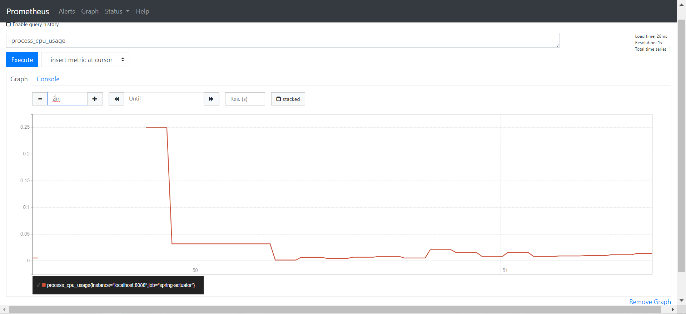
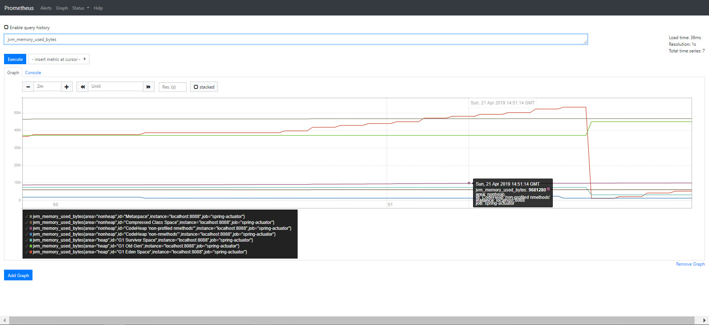
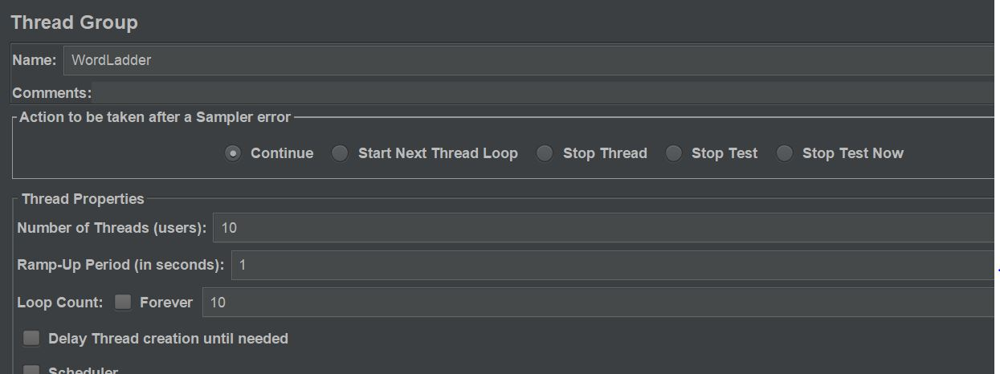
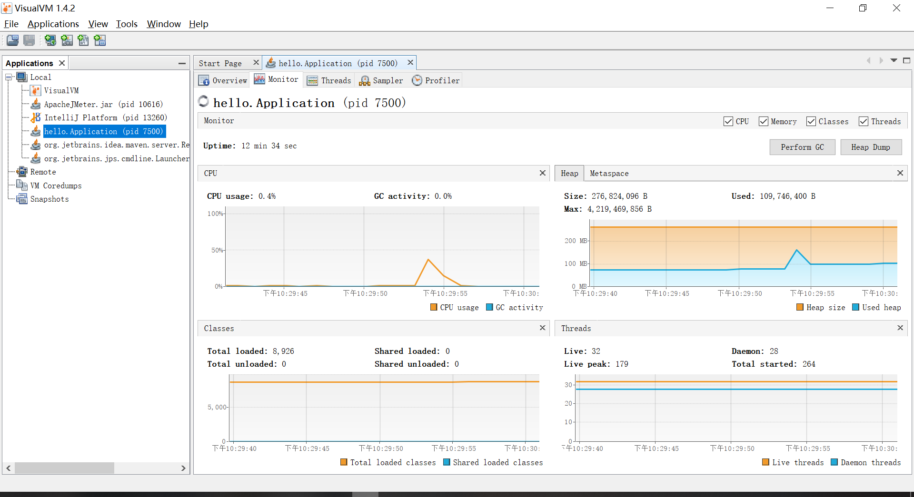
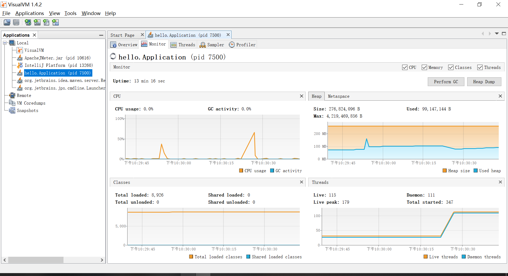
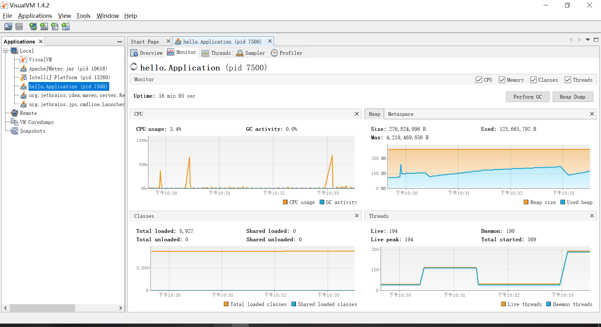

# Task 2

## Find the resources consumption of  *REST* service

## 初始情况

使用Visual VM和Prometheus获取初始资源消耗情况。

Prometheus的高峰是因为启动app时消耗了比较多的资源，在没有请求时资源消耗量低且平稳。

## 资源消耗情况

一开始，我设置了十个线程，重复十次。我进行了两次这个实验，分别使用visualVM和Prometheus来检测。

得到了如下的结果：

可以看到，cpu和内存利用率都有一个小的峰值，cpu峰值在40%（Prometheus因为请求间隔原因没有检测到峰值），内存峰值在150mb，看来这个请求数量并不是问题，于是我加大了请求数量。

这次的测试设置如图：

得到下面的结果：

可以看到，cpu和内存利用率峰值有所提高，但并不是很高，于是我再一次加大了请求数量。

这次的结果如图：

由结果看到，此次的资源消耗量更高了，我们还可以由此得出，资源消耗量和请求数、并发数呈一个正相关的态势。