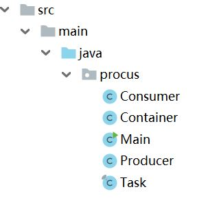
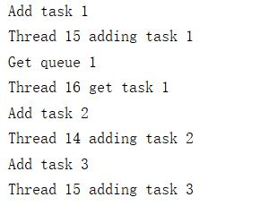

# Task-4

- Implement a container in Java

  - Properties
    - Threshold
      - If the number of items in the container is less then
        - Queue
      - Else
        - Stack
    - Timeout
      - If the time that a item is staying in the container is longer than timeout
        - Remove it
  - Write a producer and a consumer to evaluate your container
    - Multi producers, multi consumers

## Implementation

### Structure
The basic structure is as bellow: 

- Consumer and Producer
- Task
- Container
- Main

### Evaluation
The results are printed out like bellow:

We can see clearly how these threads work.